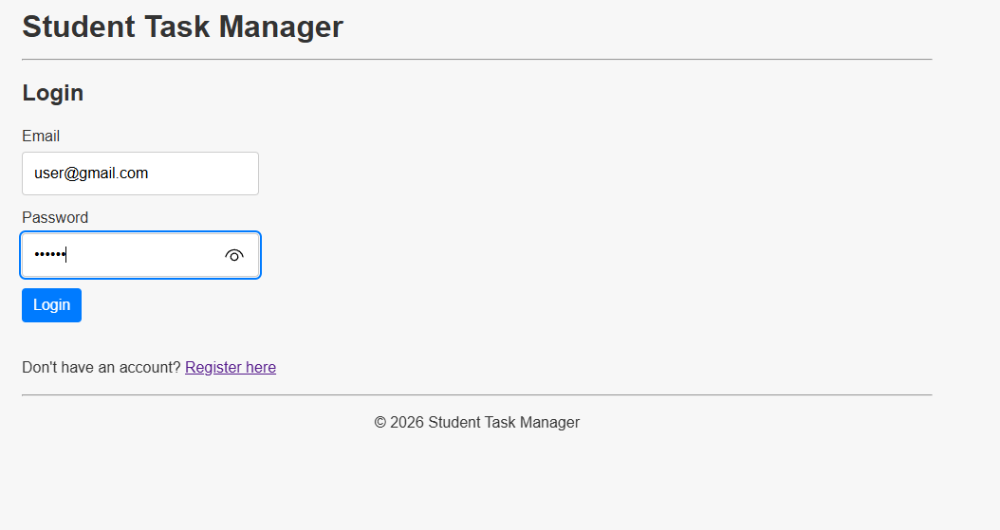
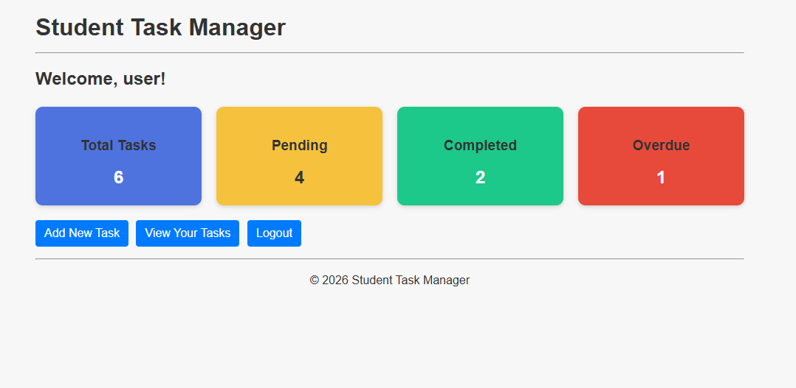
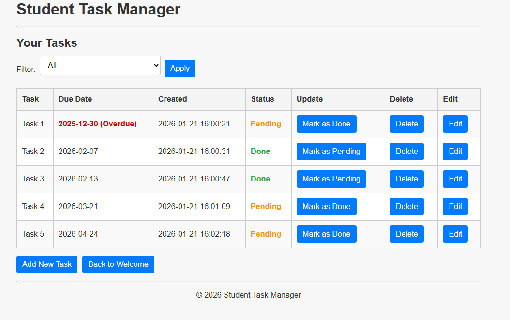
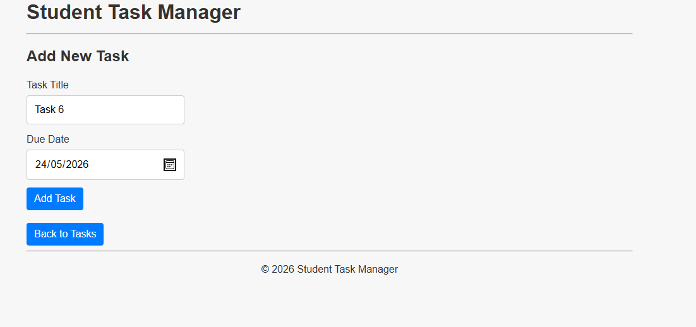
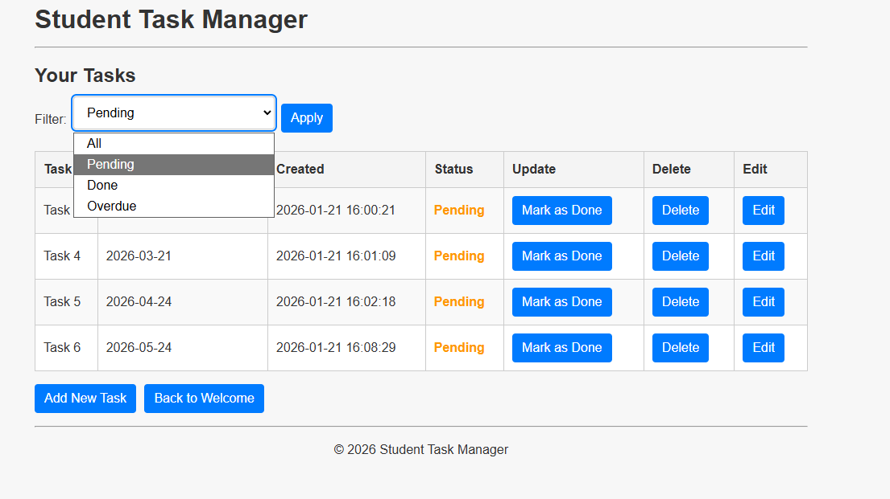

# Student Task Manager

A PHP/MySQL web application built as part of a Bachelor of Information Technology.

## Features

- User authentication (login/logout)
- Create, view, edit, and delete tasks
- Task filtering and due dates
- MySQL database integration
- Clean, simple UI

## Technologies Used

- PHP
- MySQL
- HTML
- CSS
- JavaScript

## Screenshots

### Login

### Task Management Home

### Task List

### Add New Task

### Filter Tasks

## Setup Notes

Database credentials have been removed for security.
To run locally, create `includes/db.local.php` with your own database settings.
